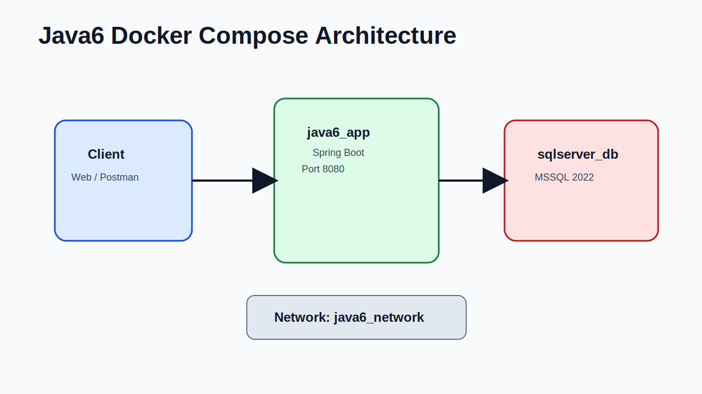
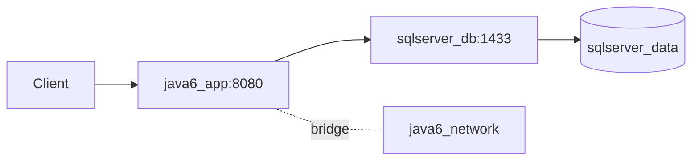
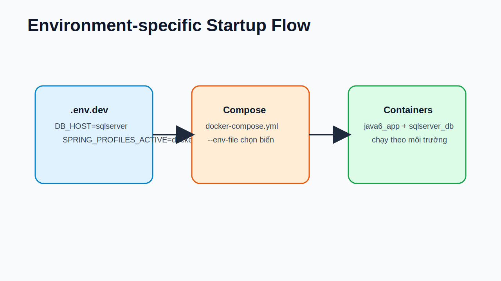
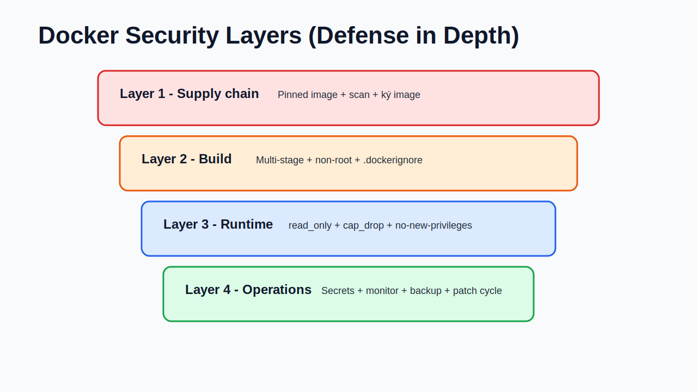
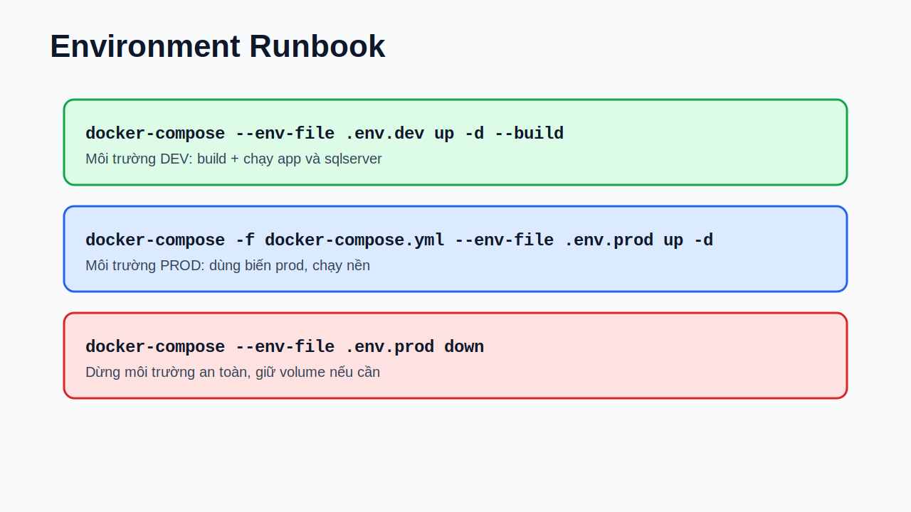

# Slide 01 - Setup Docker cho Java6 + SQL Server


- Mục tiêu: chạy project Java6 ổn định bằng Docker và SQL Server.
- Bám theo cấu hình đã có sẵn trong project hiện tại.
- Bổ sung phần nâng cao: vận hành theo nhiều môi trường + hardening bảo mật.
- Đầu ra: lệnh chạy nhanh, checklist bảo mật, mẫu cấu hình production.

---

# Slide 02 - Thành phần có sẵn trong project

- `Dockerfile`: build WAR bằng Maven và chạy bằng JRE 17.
- `docker-compose.yml`: gồm `app` + `sqlserver`.
- `.env`: chứa biến DB/JWT/profile.
- `src/main/resources/application.properties`: mapping biến môi trường sang Spring Boot.

```bash
# File chính liên quan Docker hiện có
Dockerfile
docker-compose.yml
.env
src/main/resources/application.properties
```

---

# Slide 03 - Kiến trúc tổng quan runtime



- Client gọi API vào `java6_app:8080`.
- App kết nối DB service `sqlserver_db:1433` qua bridge network `java6_network`.
- Dữ liệu SQL lưu ở volume `sqlserver_data` để không mất khi recreate container.



---

# Slide 04 - Dockerfile hiện tại (đúng project)

```dockerfile
FROM maven:3.9.6-eclipse-temurin-17 AS build
WORKDIR /app
COPY . .
RUN chmod +x mvnw
RUN ./mvnw clean package -DskipTests

FROM eclipse-temurin:17-jre
WORKDIR /app
COPY --from=build /app/target/*.war app.war
EXPOSE 8080
ENTRYPOINT ["java", "-jar", "app.war"]
```

- Dùng multi-stage: image runtime nhẹ hơn so với giữ Maven trong image final.
- `-DskipTests` giúp build nhanh hơn, phù hợp local/dev.
- App chạy dạng WAR độc lập qua `java -jar`.

---

# Slide 05 - docker-compose.yml hiện tại (đúng project)

```yaml
version: '3.8'
services:
  sqlserver:
    image: mcr.microsoft.com/mssql/server:2022-latest
    container_name: sqlserver_db
    environment:
      - ACCEPT_EULA=Y
      - MSSQL_SA_PASSWORD=${DB_PASSWORD}
    ports:
      - "${DB_PORT}:1433"
    volumes:
      - sqlserver_data:/var/opt/mssql

  app:
    build: .
    container_name: java6_app
    ports:
      - "8080:8080"
    environment:
      - DB_HOST=${DB_HOST}
      - DB_PORT=${DB_PORT}
      - DB_NAME=${DB_NAME}
      - DB_USER=${DB_USER}
      - DB_PASSWORD=${DB_PASSWORD}
    depends_on:
      - sqlserver
```

- Compose gom app + DB thành 1 stack.
- `depends_on` đảm bảo thứ tự start (không đảm bảo DB đã sẵn sàng).
- Cần thêm `healthcheck` để startup production chắc chắn hơn.

---

# Slide 06 - Mapping biến môi trường vào Spring

```properties
spring.datasource.url=jdbc:sqlserver://${DB_HOST}:${DB_PORT};databaseName=${DB_NAME};encrypt=true;trustServerCertificate=true
spring.datasource.username=${DB_USER}
spring.datasource.password=${DB_PASSWORD}

app.jwt.secret=${JWT_SECRET}
app.jwt.access-expiration-ms=${JWT_ACCESS_EXPIRATION_MS}
app.jwt.refresh-expiration-ms=${JWT_REFRESH_EXPIRATION_MS}
```

- App không hard-code thông tin DB/JWT trong source.
- Mỗi môi trường chỉ cần đổi `.env.*` là thay đổi cấu hình runtime.
- `encrypt=true` đã bật TLS; production nên dùng certificate chuẩn thay vì `trustServerCertificate=true`.

---

# Slide 07 - Quy trình setup nhanh môi trường dev

```bash
# 1) Build + chạy stack

docker-compose --env-file .env up -d --build

# 2) Kiểm tra container

docker ps

# 3) Xem log app

docker logs -f java6_app
```

- `--build` đảm bảo image app cập nhật theo code mới.
- Chạy nền với `-d` để terminal không bị chiếm.
- Nếu lỗi kết nối DB: kiểm tra `DB_HOST=sqlserver` và password SA hợp lệ.

---

# Slide 08 - Thiết kế nhiều môi trường bằng file env

```bash
# .env.dev
DB_HOST=sqlserver
DB_PORT=1433
DB_NAME=java6_dev
DB_USER=sa
DB_PASSWORD=<dev_password>
SPRING_PROFILES_ACTIVE=docker

# .env.prod
DB_HOST=sqlserver
DB_PORT=1433
DB_NAME=java6_prod
DB_USER=sa
DB_PASSWORD=<strong_prod_password>
SPRING_PROFILES_ACTIVE=prod
```

- Tách rõ `dev` và `prod` để tránh dùng nhầm DB.
- Không commit file chứa secret thật lên Git.
- Có thể thêm `.env.staging` cho môi trường kiểm thử.

---

# Slide 09 - Giải thích lệnh chạy theo từng môi trường



```bash
docker-compose -f docker-compose.yml --env-file .env.prod up -d
```

- `-f docker-compose.yml`: chọn file compose cần chạy.
- `--env-file .env.prod`: nạp biến môi trường production.
- `up -d`: tạo/chạy container ở background.
- Ứng dụng thực tế:
  - Dev: `docker-compose --env-file .env.dev up -d --build`
  - Prod: `docker-compose -f docker-compose.yml --env-file .env.prod up -d`

---

# Slide 10 - Bộ lệnh vận hành Compose cần nhớ

```bash
# Dừng stack

docker-compose --env-file .env.prod down

# Dừng và xoá volume (cẩn thận mất dữ liệu)

docker-compose --env-file .env.prod down -v

# Xem trạng thái service

docker-compose --env-file .env.prod ps

# Xem log theo service

docker-compose --env-file .env.prod logs -f app
```

- `down -v` chỉ dùng khi muốn reset sạch DB local.
- Luôn xem log app + DB cùng lúc khi debug lỗi kết nối.
- Nên chuẩn hoá runbook để cả team dùng chung lệnh.

---

# Slide 11 - Làm việc với SQL Server trong container

```bash
# Kiểm tra DB trong SQL Server container

docker exec -it sqlserver_db /opt/mssql-tools18/bin/sqlcmd \
  -S localhost -U sa -P '<SA_PASSWORD>' \
  -Q "SELECT name FROM sys.databases;"

# Tạo DB nếu cần

docker exec -it sqlserver_db /opt/mssql-tools18/bin/sqlcmd \
  -S localhost -U sa -P '<SA_PASSWORD>' \
  -Q "IF DB_ID('java6_prod') IS NULL CREATE DATABASE java6_prod;"
```

- Dùng `sqlcmd` để kiểm tra trực tiếp trạng thái DB.
- Có thể nhúng script SQL init bằng mount thư mục `./sql:/docker-entrypoint-initdb.d` (tuỳ chiến lược).
- Tránh thao tác DB thủ công trên production mà không có backup.

---

# Slide 12 - Backup/Restore SQL trong Docker

```bash
# Backup DB

docker exec -it sqlserver_db /opt/mssql-tools18/bin/sqlcmd \
  -S localhost -U sa -P '<SA_PASSWORD>' \
  -Q "BACKUP DATABASE java6_prod TO DISK='/var/opt/mssql/backup/java6_prod.bak' WITH INIT, COMPRESSION;"

# Restore DB

docker exec -it sqlserver_db /opt/mssql-tools18/bin/sqlcmd \
  -S localhost -U sa -P '<SA_PASSWORD>' \
  -Q "RESTORE DATABASE java6_prod FROM DISK='/var/opt/mssql/backup/java6_prod.bak' WITH REPLACE;"
```

- Nên mount thêm volume backup riêng: `./backup:/var/opt/mssql/backup`.
- Lập lịch backup định kỳ để giảm rủi ro mất dữ liệu.
- Kiểm thử restore định kỳ để chắc backup dùng được.

---

# Slide 13 - Hardening Dockerfile (build an toàn hơn)

```dockerfile
FROM maven:3.9.6-eclipse-temurin-17 AS build
WORKDIR /app
COPY pom.xml mvnw ./
COPY .mvn .mvn
RUN chmod +x mvnw && ./mvnw -q -DskipTests dependency:go-offline
COPY src src
RUN ./mvnw clean package -DskipTests

FROM eclipse-temurin:17-jre
RUN addgroup --system appgroup && adduser --system --ingroup appgroup appuser
WORKDIR /app
COPY --from=build /app/target/*.war app.war
USER appuser
EXPOSE 8080
ENTRYPOINT ["java","-jar","app.war"]
```

- Chạy app bằng user thường (`USER appuser`), không dùng root.
- Tách bước cache dependency giúp build nhanh và ổn định hơn.
- Kết hợp `.dockerignore` để không copy file nhạy cảm vào image.

---

# Slide 14 - Hardening runtime với Compose



```yaml
services:
  app:
    read_only: true
    tmpfs:
      - /tmp
    cap_drop:
      - ALL
    security_opt:
      - no-new-privileges:true
    pids_limit: 200
```

- `read_only` giảm nguy cơ ghi file trái phép trong container.
- `cap_drop: [ALL]` cắt quyền kernel không cần thiết.
- `no-new-privileges` ngăn tiến trình leo thang đặc quyền.

---

# Slide 15 - Quản lý secrets an toàn hơn biến env

```yaml
secrets:
  db_password:
    file: ./secrets/db_password.txt

services:
  app:
    secrets:
      - db_password
    environment:
      - DB_PASSWORD_FILE=/run/secrets/db_password
```

- Secret nằm trong file mount runtime, không xuất hiện trong `docker inspect` như env thuần.
- JWT secret cũng nên chuyển sang secret store (Vault, SSM, Doppler, 1Password Connect).
- Nếu app chưa đọc `_FILE`, có thể thêm entrypoint script để export biến trước khi chạy Java.

---

# Slide 16 - Tách network và giảm bề mặt tấn công

```yaml
services:
  sqlserver:
    networks:
      - backend
    # production nên bỏ publish port nếu chỉ app nội bộ dùng DB
    # ports:
    #   - "1433:1433"

  app:
    networks:
      - backend
      - public

networks:
  backend:
    internal: true
  public:
```

- `backend internal` làm DB không lộ trực tiếp ra ngoài host/network ngoài.
- Chỉ publish port cần thiết (thường là `8080` cho app).
- DB nên giới hạn IP truy cập hoặc đặt sau VPN/private subnet.

---

# Slide 17 - Healthcheck + tự phục hồi + giới hạn tài nguyên

```yaml
services:
  sqlserver:
    healthcheck:
      test: ["CMD", "/opt/mssql-tools18/bin/sqlcmd", "-S", "localhost", "-U", "sa", "-P", "${DB_PASSWORD}", "-Q", "SELECT 1"]
      interval: 15s
      timeout: 5s
      retries: 10

  app:
    restart: unless-stopped
    deploy:
      resources:
        limits:
          cpus: '1.0'
          memory: 1024M
```

- Healthcheck giúp phát hiện service unhealthy sớm.
- `restart` giảm downtime khi process lỗi tạm thời.
- Giới hạn CPU/RAM ngăn 1 container chiếm hết tài nguyên máy.

---

# Slide 18 - Scan image và kiểm tra lỗ hổng định kỳ

```bash
# Scan nhanh bằng Docker Scout

docker scout quickview java6_app:latest

# Scan kỹ với Trivy

trivy image java6_app:latest

# Kiểm tra base image cũ

docker images --digests | head -n 20
```

- Scan image trong CI để chặn build có CVE nghiêm trọng.
- Cập nhật base image định kỳ (hàng tuần/hàng tháng).
- Gắn SBOM và ký image (cosign/notary) nếu hệ thống yêu cầu compliance.

---

# Slide 19 - Checklist production trước khi go-live

- Đã tách `.env.prod` và không commit secret lên Git.
- DB password mạnh, rotate định kỳ, không dùng chung dev/prod.
- App chạy non-root, runtime có `read_only`, `cap_drop`, `no-new-privileges`.
- Có healthcheck, monitoring, alert log lỗi login/JWT/DB timeout.
- Có backup + restore test đạt yêu cầu RPO/RTO.
- Có quy trình cập nhật image và scan CVE định kỳ.

```bash
# Ví dụ run production chuẩn hoá
docker-compose -f docker-compose.yml --env-file .env.prod up -d
```

---

# Slide 20 - Runbook lệnh nhanh theo môi trường



```bash
# DEV

docker-compose --env-file .env.dev up -d --build

# PROD

docker-compose -f docker-compose.yml --env-file .env.prod up -d

# STOP PROD

docker-compose --env-file .env.prod down
```

- Một lệnh cho một môi trường, tránh nhầm biến cấu hình.
- Có thể thêm `Makefile`/script để team dùng chuẩn.
- Sau khi chạy: kiểm tra `docker ps`, `docker logs -f java6_app`, test API health.
